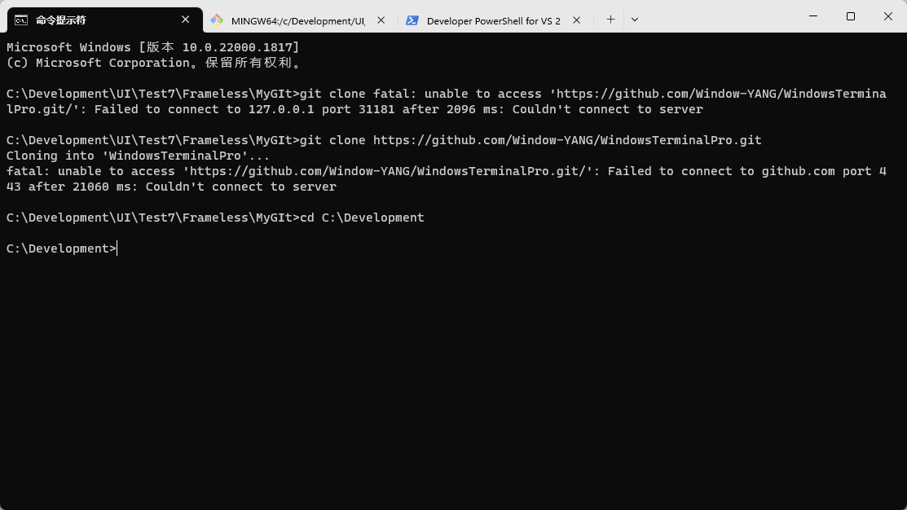
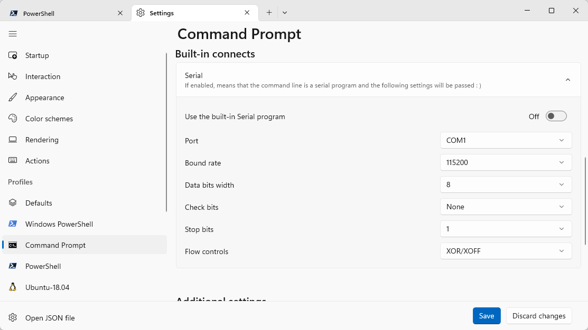

# WindowsTerminalPro
TerminalPro，微软WindowsTerminal升级版。
<!-- <video id = "video" controls = "" preload = "none" poster="./png/terminal.png">
<source id = "mp4" src = "./png/TerminalPro.mp4" type = "video/mp4">
</video> -->
https://github.com/xyang-zh/WindowsTerminalPro/issues/1

# WindowsTerminal
[Windows](https://learn.microsoft.com/zh-cn/windows/terminal/) 终端是一个新式主机应用程序，它面向你喜爱的命令行 shell，如命令提示符、PowerShell 和 bash（通过适用于 Linux 的 Windows 子系统 (WSL)）。 它的主要功能包括多个选项卡、窗格、Unicode 和 UTF-8 字符支持、GPU 加速文本呈现引擎，你还可用它来创建你自己的主题并自定义文本、颜色、背景和快捷方式。   

## 终端软件的发展
微软制作的terminal，是现在、以及后来的终端图形发展趋势，未来的终端软件，界面只会朝着更加现代、先进、自然同时功能更强大的方向发展。

## 现有的终端软件
说起终端工具就不得不提起一款软件：SecureCRT，CRT流行、稳定而且功能强大，现在仍有很多人在用，但对于当下Window桌面软件来说，是逐渐有点 “过时了” ，一方面，界面显得上世纪的风格，另一方面，CRT很多功能都需要使用人对于软件有一定深度的了解，才能熟悉使用，现在的软件朝着自然且更加自动化的方向进步，CRT不支持这些更加方便的操作。

翻译成中文：
- SecureCRT 界面跟不上现在的审美
- SecureCRT 显示的内容颜色不准确，没有**终端**应有的模样；自定义显示颜色都是古老的颜色
- SecureCRT 对自定义快捷键、快捷命令的支持很有限，用熟过terminal的知道快捷键有多么好用
- SecureCRT 显示窗口样式就几种，大多不可调整

## Terminal的特点
相比SecureCRT，Terminal有很多新特点，这里提一点：Terminal用GPU渲染的界面，显示出的终端效果秒杀市面上99.99%的终端工具！

# TerminalPro

微软有个绝招：这个功能喜欢么？喜欢我就砍掉😀🎉🎉。terminal一发布就受到了很多欢迎，但美中不足，它不支持工业型连接，比如**串口**，官方给的理由是由于可信连接等因素，推荐用**SSH**。

但对嵌入式开发的人来说，串口重要性不言而喻；而对于想用Terminal当做调试工具的人员，又不得不换到其他工具，但其他工具却比不上terminal好用。所以，[TerminalPro](https://github.com/Window-YANG/WindowsTerminalPro)就是为了解决这最后一步

[TerminalPro](https://github.com/Window-YANG/WindowsTerminalPro)内置串口功能，可直接选择串口并打开，这样就能在terminal里实现和其他终端工具一样的无缝体验

## 版本更新
v1.0
- 内置串口，点击Port选项卡，自动刷新所有串口
- 可以将经常用的串口进行保存，重新打开终端会默认打开保存的串口
- 串口断开会自动提示
- 更多功能在cmd中探索 :)

## 安装步骤
- PowerShell 7+
- 先安装证书，后安装TerminalPro（msix包）
- 新建串口终端，将终端commandline换成WindowsTerminalSerial.exe所在位置
- 使用串口前打开串口功能开关
- 保存，打开串口终端使用即可
